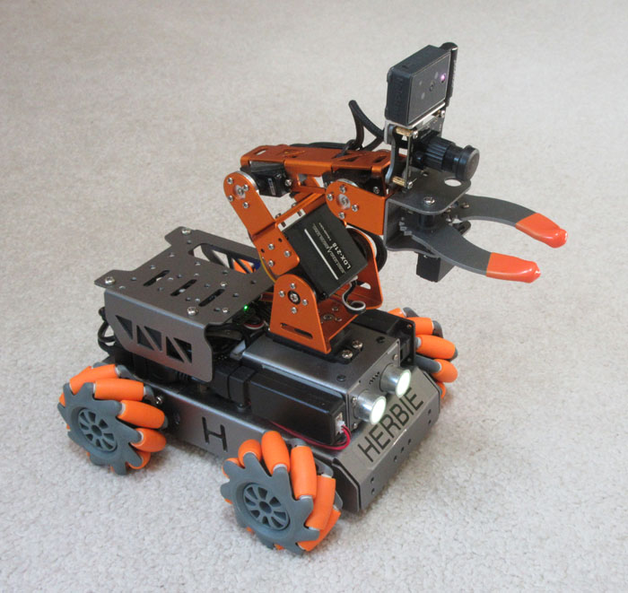

# Ganbei
## An Inexpensive Mobile Manipulator

This repository contains instructions and code for creating a small, cheap ($450) robot with verbal interaction, symbolic learning, an arm, and 3D sensing. It is a lightly modified version of the [Master Pi](https://www.hiwonder.com/products/masterpi?variant=39783006994519) platform available from Hiwonder. The robot uses the ALIA cognitive library along with Python support code to run on a Raspberry Pi 4b. Check out this [__video__](https://youtu.be/ncSaZPBFY3k) of Herbie autonomously stacking blocks.

## Overview

Start by assembling the MasterPi robot, which arrives in kit form. Next, download the Ganbei software image to a new SDHC card and install it. Finally, make the hardware modifications noted below. Some soldering and drilling is required.

1. [Parts List](doc/parts_list.md)
2. [Software Installation](doc/software.md)
3. [Hardware Modifications](doc/hardware.md)
4. [Credentials & Calibration](doc/calibration.md)
5. [Robot Operation](doc/operation.md)

To run the robot, press the button on its back to start the application then speak to it in English. You can directly move the robot ("Drive forward"), ask it questions ("Do you see a red object?"), or teach it new things ("To snatch an object grab it"). This [__video__](https://youtu.be/qWLANb0PmbM) shows some simple reasoning, while this [__video__](https://youtu.be/EjzdjWy3SKM) demonstrates the utility of teaching (on an older robot).

For a somewhat fancier version see [Wansui](https://github.com/jconnell11/Wansui).

---

June 2025 - Jonathan Connell - jconnell@alum.mit.edu

