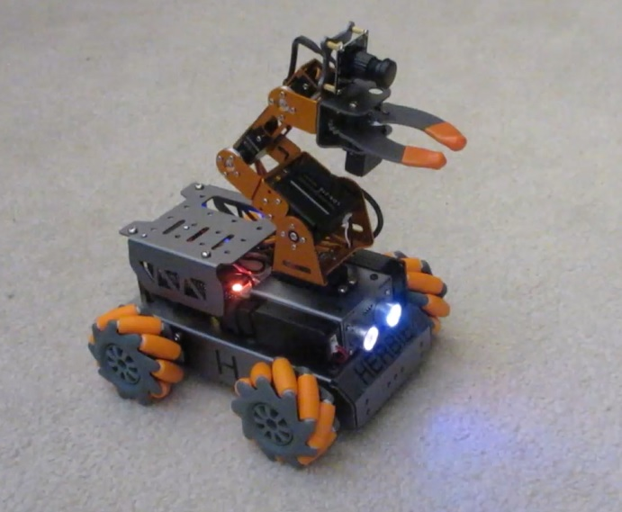

# Ganbei
## Inexpensive Mobile Manipulator

This is a very cheap ($360) small robot with verbal interaction, symbolic learning, an arm, and 3D sensing. It is a lightly modified version of the [Master Pi](https://www.hiwonder.com/products/masterpi?variant=39783006994519) available from Hiwonder. The system uses the [ALIA](https://github.com/jconnell11/ALIA) library along with Python support code to run on a Raspberry Pi 4b. Check out this [video](https://youtu.be/qWLANb0PmbM) of some simple reasoning.

---

May 2024 - Jonathan Connell - jconnell@alum.mit.edu

