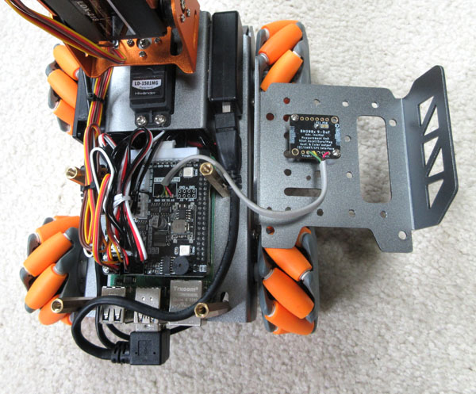

## Hardware Changes

Unfortunately, the Master Pi robot needs to be modified a bit. In terms of extra parts you will need:

* WaveShare USB soundcard + speakers ($18 from [Amazon](https://www.amazon.com/waveshare-USB-Converter-Speaker-Raspberry/dp/B08RX4DNJ4))

* right-angle 6" USB extender ($7 from [Amazon](https://www.amazon.com/gp/product/B083TGBMR4)) 
    
* 9-DOF BNO085 breakout board ($25 from [AdaFruit](https://www.adafruit.com/product/4754))

Be aware that installing the IMU will require drilling a couple of holes and soldering a few wires. 

### Fan and Elbow

The power cable from the fan does not fit where Hiwonder says (it is too fat). Instead, plug it into one of the two 4-pin header on the forward left side of the expansion board. The red wire should go to the frontmost pin.

To give the arm a better reach the elbow servo needs to be rotated 45 degrees. Start by manually adjusting the arm so it points straight up. After this, disassemble the elbow joint by undoing the 5 screws on the right side of the elbow (small servo) and pulling out the black pin and sleeve on the left. Extract the whole upper arm link and then remove the silver plate from the end of the servo.

Rotate the plate 45 degrees so the holes form a square pattern with respect to the body of the servo (as opposed to the original diamond) and push it back on. Mate the upper and lower arm sections, then reinsert the black sleeve and plug on the left side. Finally, bend the upper arm so it is pointing 45 degrees forward and reinstall the 5 screws. 

### Sound Card

This is relatively easy. First, remove the back shell of the robot using 4 screws. Cut off one of the speaker cables near the connector, then plug the remaining speaker into the WaveShare dongle. Orient the speaker so the cable is toward the rear of the robot and use Gorilla double-sided tape to affix it to the left side of the arm base (sonar box). 

Next, attach the USB extender cable to the dongle. Route it outside the front standoff (see [photo](../Herbie.jpg)), then inside the rear standoff, and finally make an S-curve into the back of the extension board. Affix the dongle (label facing inward) to the right side of the arm base using a small amount of Gorilla tape. The red and black speaker cable can be tucked under the dongle, and any excess can be stuffed inside the sonar box.

### Inertial Measurement Unit

This small board mounts rightside-up under the backshell and is held up by two diagonally placed nylon spacers left over from the original Master Pi assembly. The most fraught part is drilling the holes for these. First, remove the backshell and mark the drilling locations using a Sharpie. One should be 25mm back from the front edge and 16mm in from the right crease. The other should be 43mm back and 36mm in. Place the IMU circuitboard over your marks to make sure they align with holes on the board. When satisfied, use a 2.1mm (5/64") bit to pierce the backshell.

Next, configure the IMU for UART mode by using a blob of solder to bridge the "PS1" pads on the back of the board.

The IMU gets connected directly to the expansion board using 4 wires. I used a roughly 120mm long section of old modular telephone cable, which conveniently has 4 different colored wires (black, red, green, yellow). The wires run from one edge of the IMU board (solder them on the component side) to a series of pads near the front center of the expansion board (near the empty rectangle). You will have to separate the expansion board from the Raspberry Pi underneath in order to solder these. The proper pattern is:
    
                 5V  ---red-->  5V 
    expansion   GND  --black->  GND    IMU
      board      TX  -yellow->  SCL   board
                 RX  <-green--  SDA

Now install two 10mm long nylon spacers under the backshell in the holes you drilled using M2x5 screws. Affix the diagonal corners of the IMU board to these spacers using two more M2x5 screws. The components should be facing upwards (toward the shell) and the wires should come off the back edge of the board. Finally, restack the expansion board on the Raspberry Pi and reattach the modified backshell. 

### Calibration

After all the [software](software.md) has been installed, open a command window, cd to the Ganbei directory, then run "sudo python3 imu_calib.py". Now pick up the robot and slowly rotate it through all 3 axes. Keep hitting ENTER until status = 3, then hit 's' to permanently save the values to the board.

You should also probably calibrate the offsets for the arm servos. Again, from the Ganbei directory run "sudo python3 arm_calib.py" and follow the directions. This will write new values to the ~/MasterPi/Deviation.yaml file.

### Batteries (optional)

You can significantly extend the run-time of the robot by using higher capacity batteries. I use two [Samsung 35E](https://www.18650batterystore.com/products/samsung-35e-button-top) cells (total $16) and an [XTAR fast charger](https://www.amazon.com/gp/product/B0BS9HKYYS) (about $26) with a [3A USB brick](https://www.amazon.com/gp/product/B07QK7PXZK) ($16 for 4). The Hiwonder supplied batteries and charger, however, are adequate.

---

May 2024 - Jonathan Connell - jconnell@alum.mit.edu

