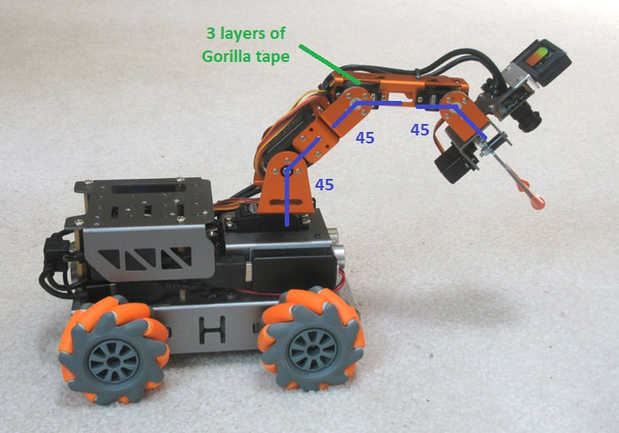
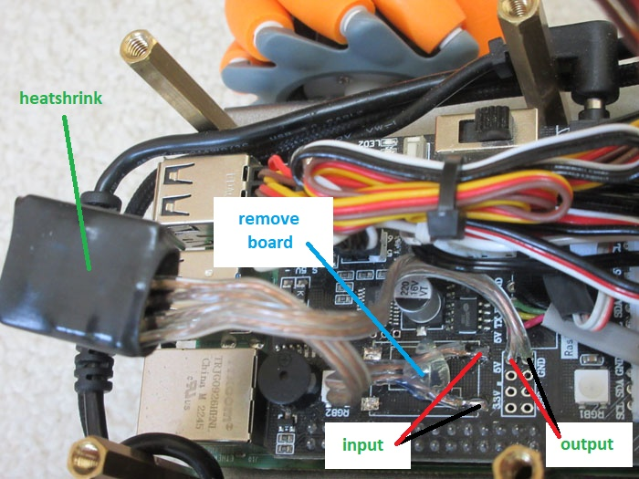
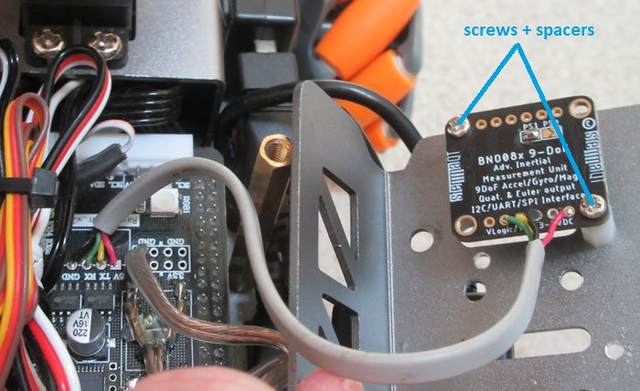
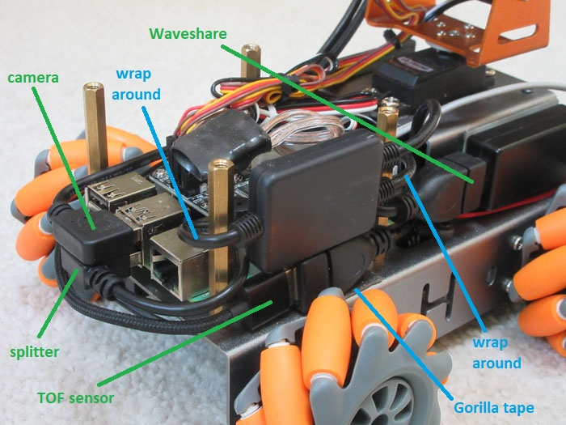
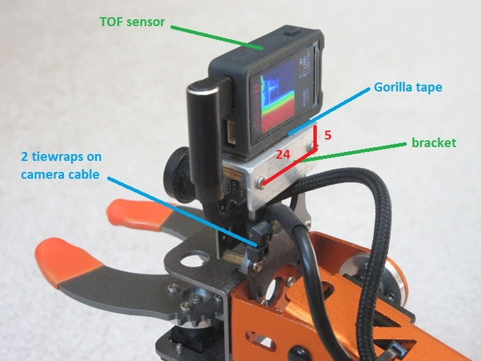

# Hardware Modifications

First, assemble the MasterPi robot following Hiwonder's instructions. This takes roughly 3 hours. After this, the required changes to the stock robot are:

1. [Minor Changes](#minor)
1. [Servo Rotation](#servo)
2. [Power Converter](#power)
3. [IMU Installation](#imu)
4. [Audio Components](#audio)
5. [TOF Mounting](#tof)

<a name="minor"></a>
## Minor Changes

Unfortunately, the __fan cable__ does not fit where Hiwonder says (it is too fat). Instead, plug it into one of the two 4-pin header on the forward left side of the expansion board. The red wire should go to the frontmost pin.

The sonar transducers on the front are never used for ranging. Instead, the associated LEDs are used for expressing internal state. To make the colors more visible from various angles, apply a piece of white __vinyl tape__ to the front of each shiny tube. Trim around the periphery using an X-acto knife.

<a name="servo"></a>
## Servo Rotation

To better reach and view the floor, the arm needs to curl in on itself. For this reason the shoulder, elbow, and wrist servos all need to be rotated so their neutral positions are 45 degrees forward. You can set the servos to the middle of their ranges by running the command below. When you are done with the adjustments this should give the arc shown in the picture.

```
python3 Ganbei/servo_test.py
```

Fix the joints one at a time staring from the wrist. Disassemble each joint by undoing the 5 screws on the right side of the servo. Next pull out the black pin and sleeve on the left (or undo 4 screws for the shoulder). Extract the whole upper link and then remove the __circular plate__ from the end of the servo. Rotate the plate 45 degrees so the holes form a square pattern with respect to the body of the servo (as opposed to the original diamond) and push it back on. Re-mate the arm sections, then reinsert the black sleeve and plug on the left side. Finally, bend each joint so it is pointing 45 degrees forward and reinstall the 5 screws on the right. 



There is also a problem where the forward flange of the elbow servo tends to break off. To maintain arm rigidity, remove the front screw so that the metallic link can be separated slightly from the servo body. Create a stack of 3 squares of Gorilla double-side tape and stick this __pad__ on top of the servo body. Finally, squeeze the servo and link back together and reinstall the front screw (or not).

<a name="power"></a>
## Power Converter

The camera and TOF sensor are somewhat finicky and really do not like power glitches. When a heavy load switches on, like the main wheels turning or one of the servos stalling, the battery voltage can droop precipitously. To help ameliorate this problem, we replace the Hiwonder DC-DC converter with a Pololu unit having a very low dropout voltage (only 0.6 volts at 3+ amps). To make this change, carefully __unsolder__ the original small power board by heating up the 4 corner contacts while gently prying underneath.



Next prepare __4 wires__ of 22 gauge about 2.5" (6cm) long. Solder these to the "VIN", "OUT", and two "GND" pads on the Pololu board (see [diagram](https://www.pololu.com/product/4892/pictures#lightbox-picture0J12273)). Carefully surface solder the other ends of the input wires to the front pads for the original converter, with "VIN" toward the middle. Then solder the output wires into the holes directly in front of this, with "VOUT" to the one marked "5V". Finally, __insulate__ the converter board by encasing it in a piece of large-diameter heatshrink tubing (or wrap it with electrical tape). The converter will be free-floating inside the shell cavity.

<a name="imu"></a>
## IMU Installation

The Masterpi has no odometry, making it very hard to tell how far the robot has turned. Adding an inertial measurement unit helps overcome this difficulty. Start by configuring the small IMU board for UART mode by using a blob of solder to __bridge__ the "PS1" pads on the back. 



Next, connect the unit directly to the expansion board using __4 wires__ about 5" (125
mm) long. I used a section of old modular telephone cable, which conveniently has 4 different colored wires (black, red, green, yellow). The wires run from one edge of the IMU board (solder them on the component side) to a series of pads near the front center of the expansion board. You will have to separate the expansion board from the Raspberry Pi underneath in order to solder these. The proper pattern is:
    
                 5V  ---red-->  5V 
    expansion   GND  --black->  GND    IMU
      board      TX  -yellow->  SCL   board
                 RX  <-green--  SDA

This small board mounts rightside-up under the backshell and is held up by two diagonally placed nylon spacers left over from the original Master Pi assembly. Start by __drilling__ two small holes (2.1mm or 5/64" diameter) in the backshell. One should be 5mm back from the front edge and 17mm in from the right crease. The other should be 23mm back and 37mm in. Now, using M2x5 screws, install two 10mm long nylon spacers under the backshell in the holes you drilled. Affix the diagonal corners of the IMU board to these spacers using two more M2x5 screws. 

<a name="audio"></a>
## Audio Components

The speaker and the audio dongle are attached to the sides of the arm base box (as can be seen in the [main image](Herbie_TOF.jpg)). Using double-sided Gorilla tape mount the __speaker__ centered on the left side of the box. Make sure that the red and black wires come out the back. Similarly, use Gorilla tape to affix the __Waveshare__ audio dongle to the right side of the box. It should be cenetered vertically and flush to the front with its USB connector facing backwards. Finally, route the speaker wire around the back and under the dongle so that it plugs into the front. Any excess cable length can be crammed inside the arm base box.



The Waveshare device does not seem to play well with other USB peripherals (at least on the Raspberry Pi) so it is isolated with a USB __splitter__ box. To install this, start by wrapping the input lead of the splitter once around the back brass support post and plugging it into the lower middle USB port of the Rapsberry Pi. Next, wrap the lower output lead of the splitter once around the front brass support post and plug it into the Waveshare unit. Feed the top lead under this one and mount its connector vertically to the main chassis with a small piece of Gorilla tape. It should be pretty far forward and have its strain-relief section smashed up against the brass support post. The cable from the Time-of-Flight sensor will plug in here.

<a name="tof"></a>
## TOF Mounting

The Time-of-Flight sensor produces a 100x100 depth image at about 18Hz that is used to find objects. It is mounted at the end of the arm above the color camera using a custom __bracket__. Start by cutting a 32mm long section of 1/2" L-shaped aluminum [extrusion](https://www.homedepot.com/p/Everbilt-1-2-in-x-3-ft-1-16-in-Thick-Aluminum-Angle-6442/332733650). Next, drill two small holes (2.1mm or 5/64" diameter) in the bracket. They should be 24mm apart and 5mm down from the crease.



Remove the back 2 screws on the top camera mounting standoffs then reinstall them with the new bracket on top with the "shelf" section forward. Affix the TOF sensor to the shelf on top using a small strip of Gorilla __tape__ so that its right side is flush with the end of the bracket. Snip off the plastic mounting lugs on the right side of the sensor. 

After this, run the right-angle USB C cable through the back hole in the orginal camera mount then up to the left side of the sensor. You also need to add 2 __tiewraps__ to the camera cable where it exists the camera mount, since wiggling the cable often causes the camera to drop out! The TOF cable then follows the camera cable down along the outside of the arm (remove and reinstall the 2 loose tiewraps holding the pair close). Finally, run the TOF cable under the left edge of the back shell and across to the USB splitter connector mounted on the right side of the robot.

---

June 2025 - Jonathan Connell - jconnell@alum.mit.edu


