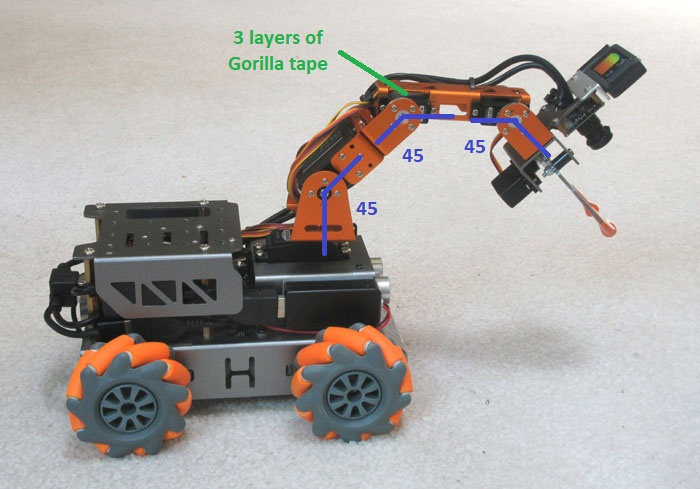
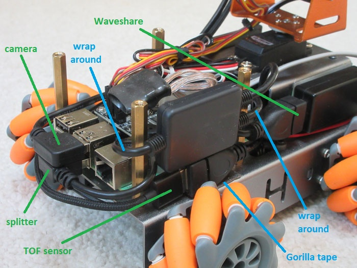
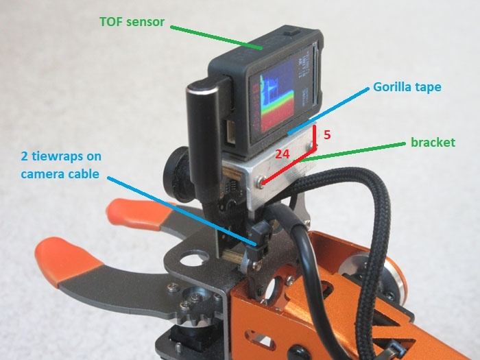
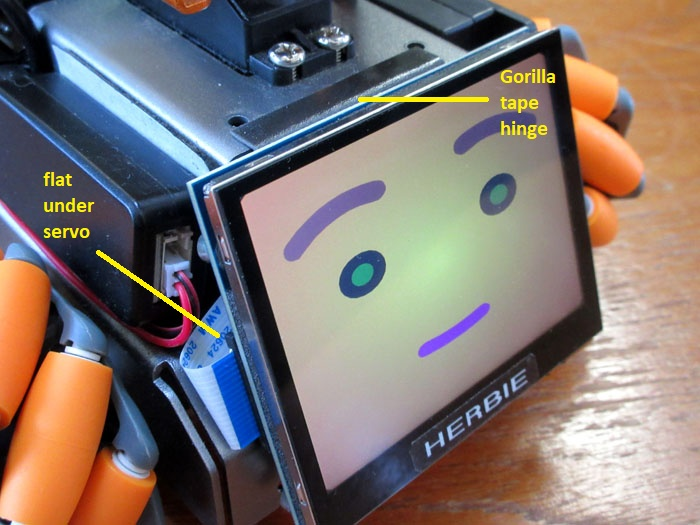
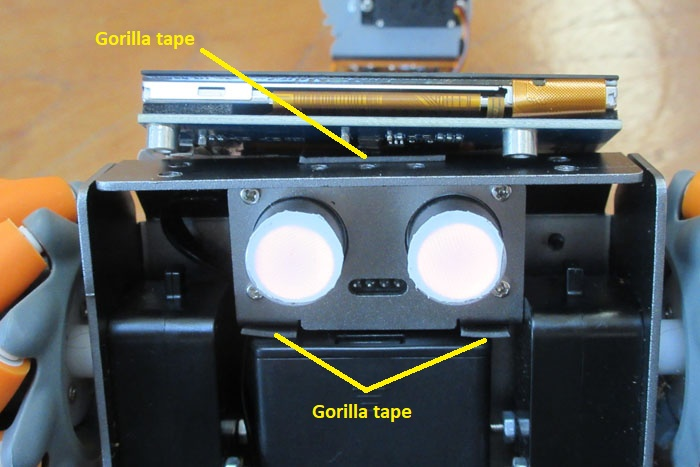

# Hardware Modifications

First, assemble the MasterPi robot following Hiwonder's instructions. This takes roughly 3 hours. If you are using your own Pi 4 board, make sure to affix the __heatsinks__ are shown [here](https://m.media-amazon.com/images/I/61Ohaathb0L._SL1001_.jpg). Then, using four leftover M3*10 screws, install the __fan__ under the circular hole in the back of the chassis with its label facing up. You will have to splice some extra wire into the leads to be able to reach servo connector 2 on the expansion board.

The sonar transducers on the front are never used for ranging. Instead, the associated LEDs are used for expressing internal state. To make the colors more visible from various angles, apply a piece of white __vinyl tape__ to the front of each shiny tube. Trim around the periphery using an X-acto knife.

## Servo Rotation

To better reach and view the floor, the arm needs to curl in on itself. For this reason the shoulder, elbow, and wrist servos all need to be rotated so their neutral positions are 45 degrees forward. When you are done with the adjustments this should give the arc shown in the picture.

You can set the servos to the middle of their ranges by running the command below. 

    arch

Fix the joints one at a time starting from the wrist. Disassemble each joint by undoing the 5 screws on the right side of the servo. Next pull out the black pin and sleeve on the left (or undo 4 screws for the shoulder). Extract the whole upper link and then remove the __circular plate__ from the end of the servo. Rotate the plate 45 degrees so the holes form a square pattern with respect to the body of the servo (as opposed to the original diamond) and push it back on. Re-mate the arm sections, then reinsert the black sleeve and plug on the left side. Finally, bend each joint so it is pointing 45 degrees forward and reinstall the 5 screws on the right. 

There is also a problem where the forward flange of the elbow servo tends to break off. To maintain arm rigidity, remove the screw from the front flange so that the metallic link can be separated slightly from the servo body. Create a stack of 3 squares of Gorilla double-side tape and stick this __pad__ on top of the servo body. Finally, squeeze the servo and link back together and reinstall the front screw (or not).

## Audio Components

The speaker and the audio dongle are attached to the sides of the arm base box (as can be seen in the [main image](Herbie_TOF.jpg)). Using double-sided [Gorilla](https://www.amazon.com/Gorilla-Heavy-Double-Sided-Mounting/dp/B082TQ3KB5) tape mount the __speaker__ centered on the left side of the box. Make sure that the red and black wires come out the back. Similarly, use Gorilla tape to affix the Waveshare __audio dongle__ to the right side of the box. It should be centered vertically and flush to the front with its USB connector facing backwards. Finally, route the red-and-black speaker wire around the back and under the dongle so that it plugs into the front. Any excess cable length can be crammed inside the arm base box.

The Waveshare device does not seem to play well with other USB peripherals (at least on the Raspberry Pi) so it is isolated with a USB __splitter__ box. To install this, start by wrapping the input lead of the splitter once around the back brass support post and plugging it into the lower middle USB port of the Rapsberry Pi. Next, wrap the lower output lead of the splitter once around the front brass support post and plug it into the Waveshare unit. Feed the top lead under this one and mount its connector vertically to the main chassis with a small piece of Gorilla tape. It should be pretty far forward and have its strain-relief section smashed up against the brass support post. The cable from the Time-of-Flight sensor will plug in here.

## TOF Mounting

The Time-of-Flight sensor produces a 100x100 depth image at about 18Hz that is used to find objects. It is mounted at the end of the arm above the color camera using a custom __bracket__. Start by cutting a 32mm long section of 1/2" L-shaped aluminum [extrusion](https://www.homedepot.com/p/Everbilt-1-2-in-x-3-ft-1-16-in-Thick-Aluminum-Angle-6442/332733650). Next, drill two small holes (2.1mm or 5/64" diameter) in the bracket. They should be 24mm apart and 5mm down from the crease.

Remove the back 2 screws on the top camera mounting standoffs then reinstall them with the new bracket on top with the "shelf" section forward. Affix the TOF sensor to the shelf on top using a small strip of Gorilla __tape__ so that its left side is flush with the end of the bracket. Snip off the plastic mounting lugs on the right side of the sensor. 

After this, run the right-angle USB C cable through the back hole in the orginal camera mount then up to the left side of the sensor. You also need to add 2 __tiewraps__ to the camera cable where it exists the camera mount, since wiggling the cable often causes the camera to drop out! The TOF cable then follows the camera cable down along the outside of the arm (remove and reinstall the 2 loose tiewraps holding the pair close). Finally, run the TOF cable under the left edge of the back shell and across to the USB splitter connector newly installed on the right side of the robot.

Although not needed, the source code for the imaging depth sensor can be found in [tof_cam](https://github.com/jconnell11/tof_cam).

## Animated Face

This is a totally optional upgrade but, if you want, you can add a face as shown in this [__video__](https://youtu.be/us3D3ikTyqY). This uses a 3.5" DSI-connected [LCD panel](https://www.amazon.com/dp/B0G2SFFZLQ) from Waveshare ($45) mounted to the font bumper of the robot. Since this is where the sonar normally lives, you need to first remove the top two screws holding the sonar panel in place then set the subassembly aside for later.

The panel connects to the front of the Pi 4 board using the white 160mm [FPC 15pin](https://www.waveshare.com/wiki/3.5inch_DSI_LCD_(E)) cable supplied with the LCD. Route this cable __flat__ under the rotation servo at the base of the arm. Affix a flap of Gorilla tape to the top of the sonar box as shown above, and also add a pad of Gorilla tape to the angled protion of the front bumper as shown below. Center the panel then push firmly into place onto the tape.

Next, reroute the sonar cable and remount the sensors to the front of the battery case underneath the robot using two small pads of Gorilla tape. Now there will be a pulsing puddle of light in front of the robot when it speaks.

Finally, you need to set up the __software environment__. Edit the beginning of the [mpi_spout.py](../project/scripts/mpi_spout.py) file in the Ganbei/scripts directory so that it loads the animated face library instead of just the plan TTS library. Then edit [config.txt](../project/deb12_files/boot/firmware/config.txt) in the /boot/firmware directory to uncomment the very last line. 

    sudo nano /boot/firmware/config.txt

Although not needed, the source code for the face can be found in [hmore_face](https://github.com/jconnell11/hmore_face) under the [mpi_face](https://github.com/jconnell11/hmore_face/tree/main/mpi_face) subdirectory.

---

May 2026 - Jonathan Connell - jconnell@alum.mit.edu

